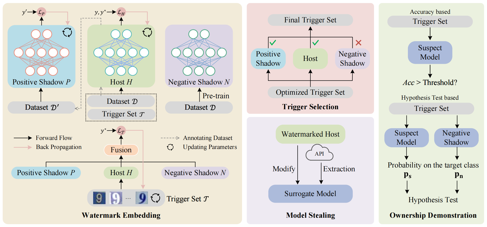

# SSW-DNN-Watermark

The repository for the paper "[Deep Neural Network Watermarking against Model Extraction Attack](https://dl.acm.org/doi/abs/10.1145/3581783.3612515)".

# Overview

We propose a trigger set based model watermarking algorithm named SSW, which utilizes symmetric shadow models for trigger set optimization during watermark embedding. The positive shadow model mimics surrogate models. The negative shadow model imitates irrelevant independent models. The trigger images are optimized to make the watermark persist in the host model and its stolen copies. Our method could well support two specific embedding schemes: embedding the watermark via fine-tuning or from scratch. The results also show that our method is robust to common model extraction attacks and model modification schemes.



# Dataset Preparation

All the datasets will be put in the `data` folder by default. You can change it by specifying `--data_path`. 

Except the downsampled version of ImageNet, all the datasets will be downloaded automatically by torchvision. We downloaded the 32 x 32 downsampled version of ImageNet following the instructions in its [official website](https://patrykchrabaszcz.github.io/Imagenet32/).

# Model Training

## Running Scripts

The code is run from `main.py`. We have prepared the scripts and configuration files to reproduce our experiments in `scripts` and `config`. 

```
scripts
|-- cifar10.sh
|-- cifar100.sh
`-- fashion.sh
config
|-- cifar10
|   |-- cifar10_clean.yaml        # default parameters to trian clean models on cifar10.
|   |-- cifar10_watermark.yaml    # default parameters to trian watermarked models on cifar10 (from pretrained).
|   `-- cifar10_watermark_fs.yaml # default parameters to trian watermarked models on cifar10 (from scratch).
|-- cifar100
|   |-- cifar100_clean.yaml
|   |-- cifar100_watermark.yaml
|   `-- cifar100_watermark_fs.yaml
`-- fashion
    |-- fashion_clean.yaml
    |-- fashion_watermark.yaml
    `-- fashion_watermark_fs.yaml
```

Generally, you should:

- Step 1: Train a clean model. Refer to the running command in `scripts/dataset.sh`.

- Step 2: Watermark a model. Replace the `clean_model_path` argument in `config/dataset/dataset_watermark.yaml` or  `config/dataset/dataset_watermark_fs.yaml` with the path to your clean model obtained in Step 1. Then use the running command in `scripts/dataset.sh`.

- Step 3: Attack a watermarked model. Replace the `--victim_path` argument in  `scripts/dataset.sh` with your watermarked model path in Step 2. Then start running.

Once a model is trained, you can use `--action evaluate` to evaluate a specified model by providing `--checkpoint_path /path/to/last.pth`.

## Directory Structure

The directory structure for experimental logs is as follows. They will be automatically created and organized. You need to provide `--runname runname` for each running.

```
ogs
|-- cifar10  # args.dataset: [cifar10, cifar100, fashion]
|   |-- clean
|   |   `-- mm-dd-hh-mi-runname
|   `-- watermark
|       `-- mm-dd-hh-mi-runname
|           |-- attack
|           |   |-- cross  # args.attack_type
|           |   |   `-- runname
|           |   |-- knockoff
|           |   |   `-- runname
|           |   `-- retrain
|           |       `-- runname
|           `-- trigger
|               `-- examples
|-- cifar100
|-- fashion
|-- ...
```

There are three kinds of models involved in our experiments:

- clean model (models without watermarks). Each `logs/dataset/clean/mm-dd-hh-mi-runname` directory corresponds to a clean model.

- watermarked model. Each `logs/dataset/watermark/mm-dd-hh-mi-runname` directory corresponds to a watermarked model.

- attacker's model. Each `logs/dataset/watermark/mm-dd-hh-mi-runname/attack/attack_type/runname` directory corresponds to an attacker's model, which is an attacked version of the watermarked model. The `attack_type` can be chosen from `['retrain', 'distill', 'knockoff', 'cross','ftal', 'rtal', 'prune', 'quantization']`. It is decided by the `--attack_type` argument.

After each running, you can get the model checkpoint (best.pt, last.pt), configuration files (conf.json) console printings (log.txt) metrics (history.csv).

For watermarking a model, you will also get a trigger set checkpoint which saves the whole trigger set (key.pt). If you use `--save_trigger`argument, you can have trigger set images save as png files.

# Attack Evaluation

Evaluation metrics:

- Test accuracy: accuracy on the test set.

- Watermark success rate: the difference between the trigger set classification accuracy on a suspect versus non-watermarked model.

- p-value: Using T-test and calculate the p-value.

To reproduce the results presented in our paper, you should:

- Step 1: Train several clean models, watermarked models, attacker's models. 

- Step 2: Replace the `/path/to/last.pth` with the path to your trained models in `modelpool.py`.

- Step 3: Run `attack_evaluate.py`. You can modify the dataset, watermarking method, attack types.

# Citation

If you found the code/scripts here are useful to your work, please cite it by

```
@inproceedings{tan2023deep,
  title={Deep Neural Network Watermarking against Model Extraction Attack},
  author={Tan, Jingxuan and Zhong, Nan and Qian, Zhenxing and Zhang, Xinpeng and Li, Sheng},
  booktitle={Proceedings of the 31st ACM International Conference on Multimedia},
  pages={1588--1597},
  year={2023}
}
```
